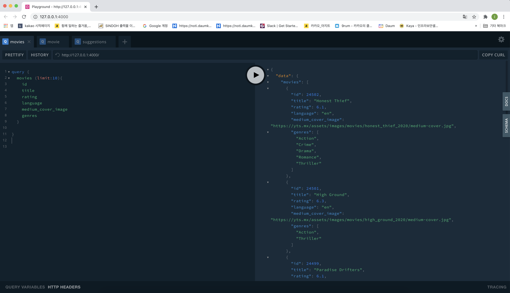

- graphQL
- nodejs
- react-native

# `push.sh`

> forked repo 와 upstream으로 push (auto fetch)

```bash
$ git remote add upstream https://github.com/[Original Owner].git
$ sh push.sh "커밋 명령어"
```

- Category 설정

```bash
CURRENT_CATEGORY='[<현재 공부하는 카테고리>]'
```

# GraphQL

> ./sandbox/graphql

> I Use [`graphql-yoga`](https://github.com/prisma-labs/graphql-yoga)

- 환경 설정

```bash
$ yarn init
yarn init v1.22.10
question name (movieql):
question version (1.0.0):
question description: Movie API with GraphQL
question entry point (index.js):
question repository url: https://github.com/minkj1992/winner-winter.git
question author: minkj1992
question license (MIT):
question private:
success Saved package.json

$ yarn add graphql-yoga
$ yarn global add nodemon # 스크립트 변경시 노드 서버(graphql-yoga) refresh
$ yarn add babel-node --dev
$ yarn global add babel-cli --ignore-engines
# 실행 전에 .babelrc 생성
$ yarn add babel-cli babel-preset-env babel-preset-stage-3 --dev
$ yarn start
```

- `vs_code GraphQL` 추가해주면 좋다.
- Server(GraphQL Playground) on http://127.0.0.1:4000

- Playground 쿼리 예시

```json
query {
	movies (limit:10){
    id
  	title
    rating
    language
    medium_cover_image
  }

	movie(id:24502){
    title
  }
  suggestions(id:24502){
    title
  }
}
```



## react-hooks

> ./sandbox/hooks

> A collection of useful React Hooks NPM Packages

- react `Create-React-App`(CRA) + `next.js`

- 환경설정

```bash
$ npx create-react-app hooks
$ cd hooks
$ npm start
```

- packages
  - [x] useInput
  - [x] useTabs
  - [x] useTitle
  - [ ] useClick
  - [ ] usePageLeave
  - [ ] useFadeIn
  - [ ] useFullscreen
  - [ ] useHover
  - [ ] useNetwork
  - [ ] useNotification
  - [ ] useScroll
  - [ ] usePreventLeave
  - [ ] useConfirm
  - [ ] useAxios
