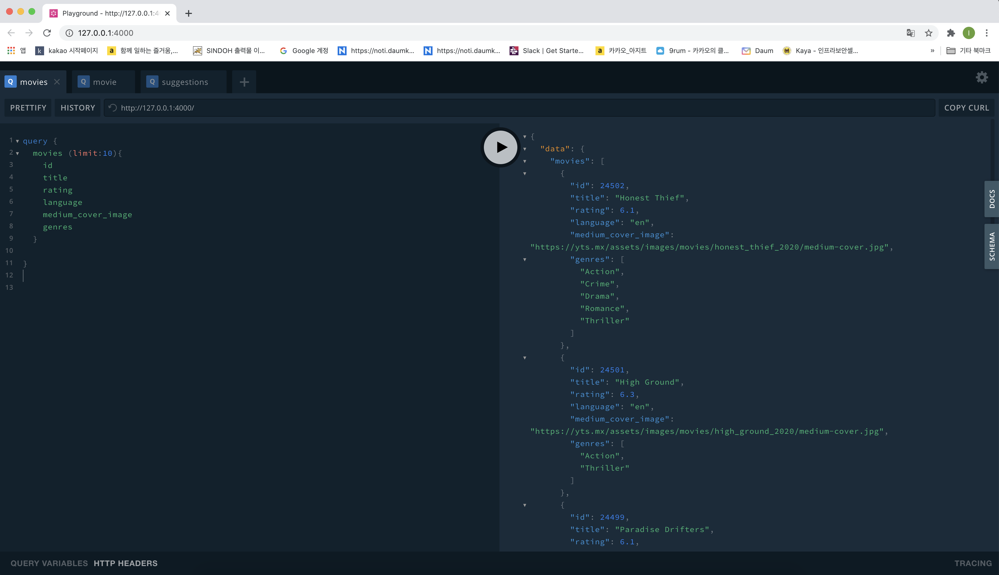

- graphQL
- nodejs
- react-native

## `push.sh`

> forked repo 와 upstream으로 push (auto fetch)

```bash
git remote add upstream https://github.com/[Original Owner].git
sh push.sh "커밋 명령어"
```

- Category 설정

```bash
CURRENT_CATEGORY='[<현재 공부하는 카테고리>]'
```

## GraphQL

> ./sandbox/graphql

> I Use [`graphql-yoga`](https://github.com/prisma-labs/graphql-yoga)

- 환경 설정

```bash
$ yarn init
yarn init v1.22.10
question name (movieql):
question version (1.0.0):
question description: Movie API with GraphQL
question entry point (index.js):
question repository url: https://github.com/minkj1992/winner-winter.git
question author: minkj1992
question license (MIT):
question private:
success Saved package.json

$ yarn add graphql-yoga
$ yarn global add nodemon # 스크립트 변경시 노드 서버(graphql-yoga) refresh
$ yarn add babel-node --dev
$ yarn global add babel-cli --ignore-engines
# 실행 전에 .babelrc 생성
$ yarn add babel-cli babel-preset-env babel-preset-stage-3 --dev
$ yarn start
```

- `vs_code GraphQL` 추가해주면 좋다.
- Server(GraphQL Playground) on http://127.0.0.1:4000

- Playground 쿼리 예시

```json
query {
  movies (limit:10){
    id
    title
    rating
    language
    medium_cover_image
  }

  movie(id:24502){
    title
  }
  suggestions(id:24502){
    title
  }
}
```



## react-hooks

> ./sandbox/hooks

> A collection of useful React Hooks NPM Packages

- react `Create-React-App`(CRA) + `next.js`

- 환경설정

```bash
npx create-react-app hooks
cd hooks
npm start
```

- packages
  - [x] useInput
  - [x] useTabs
  - [x] useTitle
  - [x] useClick
  - [x] usePageLeave
  - [x] useFadeIn
  - [x] useFullscreen
  - [x] useHover
  - [x] useNetwork
  - [x] useNotification
  - [x] useScroll
  - [x] usePreventLeave
  - [x] useConfirm
  - [x] useAxios

## Apollo-Client

```bash
$ npx create-react-app movieql-client
$ yarn add styled-components react-router-dom
# https://www.apollographql.com/docs/react/get-started/
$ npm install @apollo/client graphql
# apollo-boost @apollo/react-hooks graphql

# allow arror function
$ npm  i -D babel-eslint
$ yarn start

```

- backend graphql 실행

```bash
# learning/minkj1992/sandbox/graphql
yarn start
```

- home


- deatil with suggestion
  

## nodejs

```bash
# 1. node install from node.js public site
# vscode extension auto close tag
# Code Spell Checker
# Bracket Pair Colorizer 2
node <fileName>
```

- es6 import 문 사용하기 위한 세팅
  - <https://www.daleseo.com/js-node-es-modules/>
- package.json

```json
{
  "type": "module"
}
```

## express

- express

```bash
# for update npm
sudo npm install -g npm

npm init
npm install express --save

```

- express-generator

```bash
npm install express-generator -g
express --view=pug <앱이름>
cd <앱이름>
npm i
DEBUG=<앱이름>:* npm start
```

## Typescript

```bash
yarn init
yarn global add typescript
yarn add typescript # https://github.com/TypeStrong/ts-node/issues/707#issuecomment-457448149
yarn add tsc-watch --dev # refresh
```

- constructor 귀찮으니, TypeScript constructor generator extension 사용

  - lombok같은 기능이 있으면 좋겠다는 취지로 찾아봄
  - cmd + shift + p -> `typescript:Generate constructor`

- hash 값

```bash
yarn add crypto-js
```
